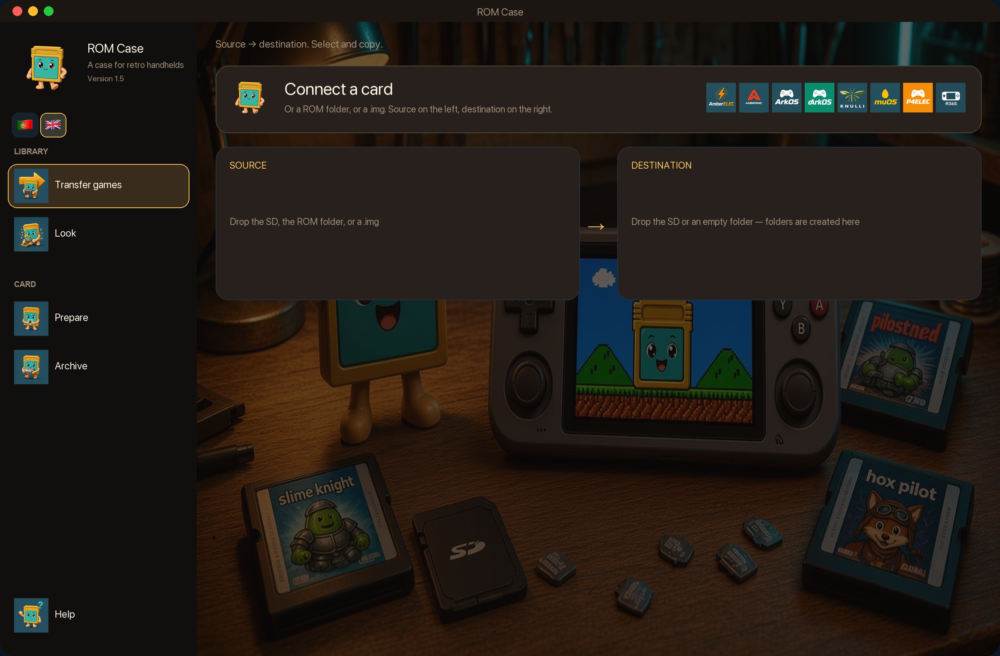
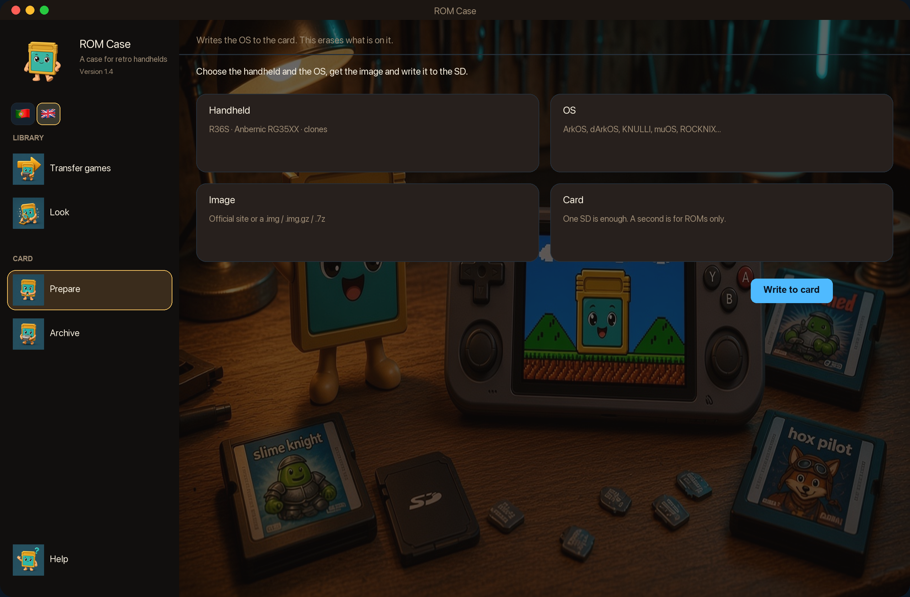
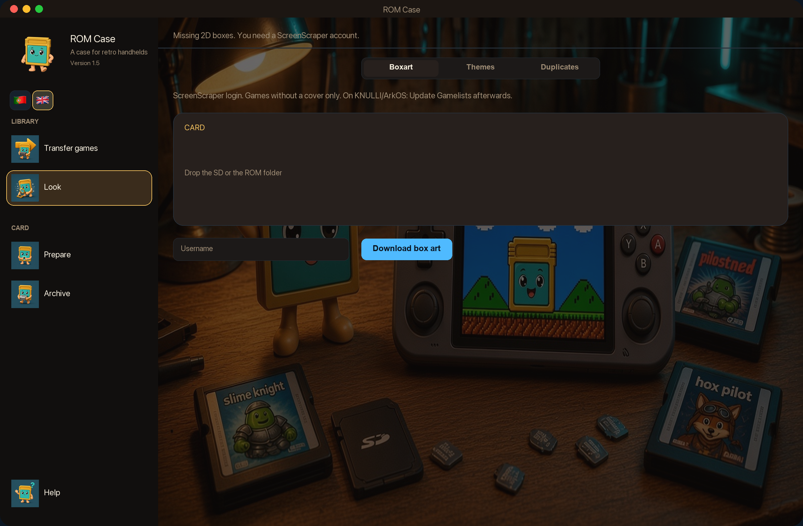
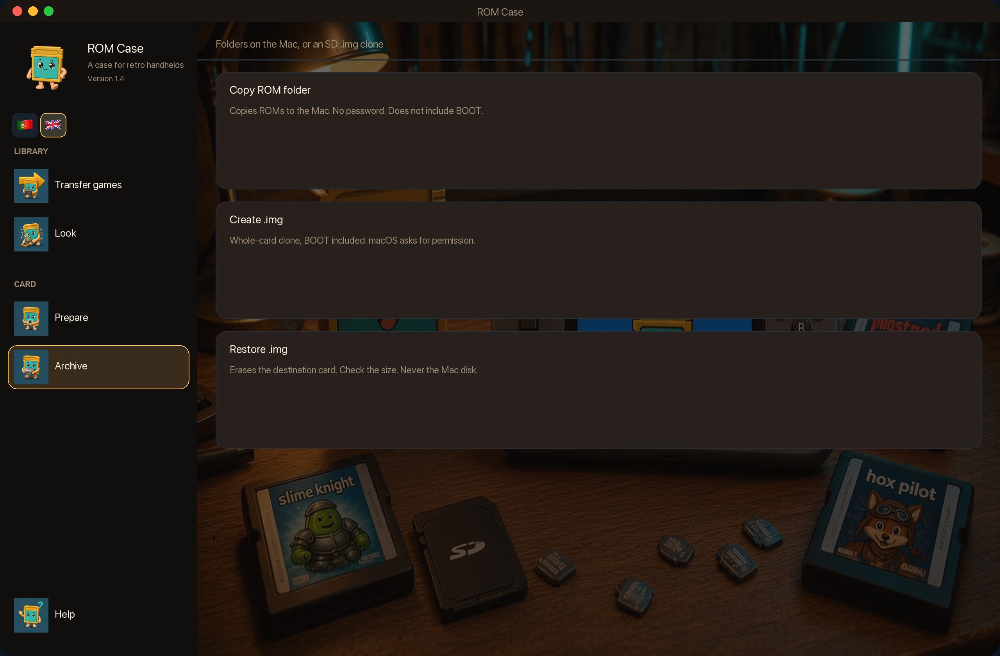
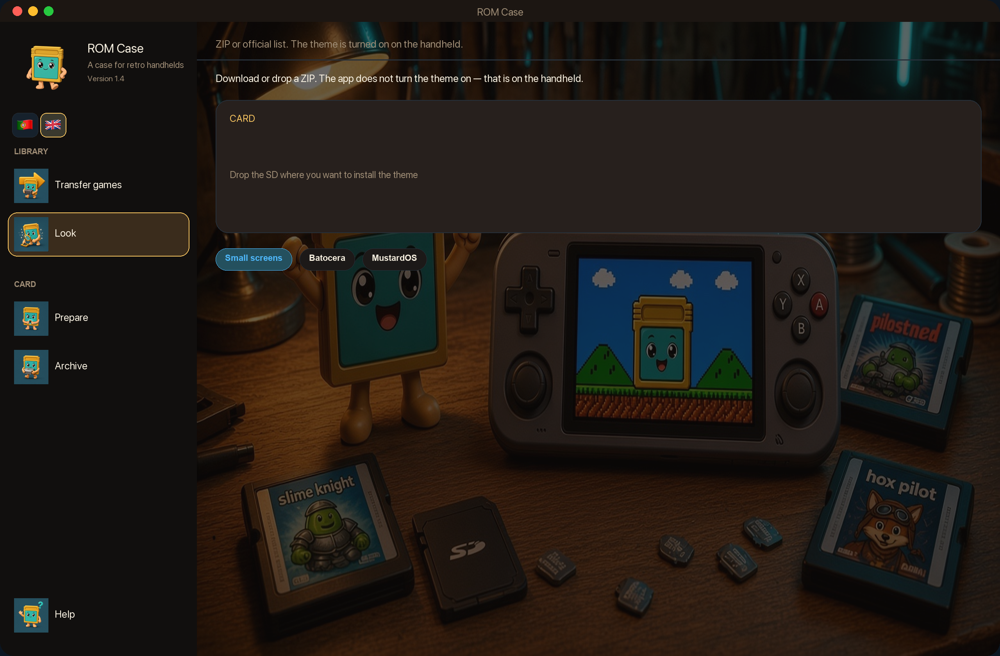

  

<h1 align="center">ROM Case</h1>

  <strong>English</strong> · <a href="README.pt.md">Português</a>

  A native macOS case for retro handhelds — <strong>R36S</strong>, <strong>Anbernic</strong> (RG35XX and friends), 
  and the cards that hold their ROMs, BIOS, saves and covers.

  
  &nbsp;&nbsp;
  
  &nbsp;&nbsp;
  
  &nbsp;&nbsp;
  
  &nbsp;&nbsp;
  
  &nbsp;&nbsp;
  
  &nbsp;&nbsp;
  
  &nbsp;&nbsp;
  
  &nbsp;&nbsp;
  

  <strong>ArkOS</strong> · <strong>dArkOS</strong> · <strong>PAN4ELEC</strong> · <strong>AmberELEC</strong> · <strong>KNULLI</strong> ·
  <strong>ROCKNIX</strong> · <strong>Anbernic Stock</strong> · <strong>Stock OS Mod</strong> · <strong>muOS</strong>

  
  &nbsp;
  
  &nbsp;
  

  <a href="https://github.com/mad4tv/romcase/releases/latest"><strong>Download the installer (.dmg)</strong></a>
  ·
  v1.7.2 · macOS 14+ · Apple Silicon
  ·
  <a href="https://www.buymeacoffee.com/joseteixeira">Buy Me a Coffee</a>

  

  
  &nbsp;
  
  &nbsp;
  
  &nbsp;
  
  &nbsp;
  
  &nbsp;
  
  &nbsp;
  

  Click a thumbnail for the full screenshot

---

## What it is

**ROM Case** is a Mac app for people who keep **R36S** clones and **Anbernic** handhelds (RG35XX Plus, H, Pro and the rest of that shelf) on more than one firmware.

It sees the SD card when you plug it in, names the OS (or lets you pick it), and then does the boring work that usually means a Finder window, the wrong folder, and a missing `.srm`.

English is the default language in the app when macOS is not Portuguese. Click 🇵🇹 or 🇬🇧 on the first-run menu (or in the sidebar) to switch; that choice is remembered.

The **source code stays private**. This page is documentation and downloads. Cloning this repository does **not** include the app source or a working project — only the README and the pictures on this page. The `.dmg` lives in [Releases](https://github.com/mad4tv/romcase/releases), not in git. GitHub cannot turn off cloning of a public repo.

## Download

**[ROM-Case-1.7.2.dmg](https://github.com/mad4tv/romcase/releases/latest/download/ROM-Case-1.7.2.dmg)** — drag **ROM Case** into Applications.

[All versions](https://github.com/mad4tv/romcase/releases)

### Requirements

- **macOS 14** (Sonoma) or later
- **Apple Silicon** (M1, M2, M3, M4)
- An SD card / USB card reader that the Finder can mount
- Optional: a [ScreenScraper](https://www.screenscraper.fr) account if you want missing 2D box art filled in

No Xcode is needed to run the downloaded app.

## What the app does

| | Task | |
| :---: | --- | --- |
|  | **Prepare** | Write a handheld OS onto a blank SD (official image or a `.img` you already have). Typical devices: **R36S** (ArkOS, dArkOS, PAN4ELEC, AmberELEC, ROCKNIX, …) and **Anbernic** RG35XX (stock, **Stock OS Mod**, KNULLI, muOS, ROCKNIX). Stock OS Mod also fixes the partition table after writing so the card can expand. Optional second card for ROMs only. **Erases the card.** |
|  | **Transfer games** | Source (old SD, ROM folder, or mounted `.img`) → destination. Copies ROMs, BIOS, saves and covers into the folder each OS actually uses. |
|  | **Folders** | Create the empty OS layout on a new card before you copy anything. |
|  | **Box art** | Fill in missing 2D boxes via ScreenScraper (member account on screen). Then Update Gamelists on KNULLI / ArkOS. |
|  | **Themes** | Lists per OS (small 4:3 screens / Batocera / MustardOS) or drop a ZIP / `.muxthm` onto the card. The handheld still turns the theme on. |
|  | **Duplicates** | Find identical ROM files on the card and delete the extras. One copy is always kept. |
|  | **Archive** | Copy ROM folders to the Mac, or clone the **whole** SD to a `.img` (BOOT included) and restore it later. |

Also:

- **Eject** sits next to every card or disk. It ejects the whole physical SD (BOOT and SHARE), never the Mac’s internal disk. A mounted `.img` is unmounted instead.
- **English or Portuguese** on the first-run menu (🇵🇹 / 🇬🇧) and in the sidebar. The choice is remembered. Hover any control for a short tip in that language.
- The first launch shows a **quick menu** (Prepare, Archive, Transfer, Look). After that, use the bar on the left.

It will not mix layouts. ArkOS-style cards (R36S), Batocera/KNULLI, Anbernic stock and muOS stay in their own folders.

## Install

1. [Download `ROM-Case-1.7.2.dmg`](https://github.com/mad4tv/romcase/releases/latest/download/ROM-Case-1.7.2.dmg)
2. If macOS shows **“Apple could not verify…”** / **Move to Trash**, that is Gatekeeper. **Do not** move it to the Trash. Click **OK**, then:
   - **System Settings → Privacy & Security**
   - Scroll to the message about `ROM-Case-1.7.2.dmg`
   - **Open Anyway** → confirm **Open**
3. Drag **ROM Case** into **Applications**
4. If the app itself is blocked: right-click → **Open** → confirm
5. Plug in an SD, or drop a folder / `.img`

The installer is ad-hoc signed (no Apple notarization yet). Safari and Chrome mark downloads as quarantined; only an Apple Developer ID + notarization removes that warning. Until then, **Open Anyway** in Privacy & Security is the intended path. Do not turn Gatekeeper off.

## Disclaimer — you can lose data

**ROM Case can permanently erase or overwrite what is on an SD card.** Prepare writes a handheld OS (the whole card goes). Restoring a `.img` does the same. **Move** deletes files on the source after copying. **Duplicates** deletes extra copies. Power loss, a failing card, or picking the wrong volume can make it worse: games, saves, BIOS, artwork, or the handheld’s system may be gone.

**You** are responsible for:

- Making a backup (**Archive**) before you write, move, or erase
- Checking that the selected card is the one you meant (name and size)
- The ROMs, BIOS and firmware images you choose, and for having the right to use them

The app is provided **as-is, without warranty**. To the extent the law allows, **José A. Teixeira (AKA Mad4linux)** is not liable for data loss, damaged cards, handhelds that no longer boot, or any other damage from using ROM Case.

Downloading or using the app means you have read this and accept that the risk and the responsibility are yours.

## Supported systems

| OS | Family | Handhelds (typical) |
| --- | --- | --- |
| ArkOS 2.0 | ArkOS | **R36S** · AeolusUX (archived) |
| dArkOS | ArkOS | **R36S** · dArkOSen |
| AmberELEC | ArkOS | RK3326 · RG351 · also **R36S** |
| PAN4ELEC | ArkOS | **R36S** Panel 4 |
| KNULLI | Batocera | **Anbernic** RG35XX |
| ROCKNIX | Batocera | **R36S** · RG35XX · JELOS |
| Anbernic Stock | Anbernic | **Anbernic** RG35XX Pro / Plus / H · original OS |
| Stock OS Mod | Anbernic | **Anbernic** H700 · cbepx-me mod (expandable card) |
| muOS | MustardOS | **Anbernic** RG35XX · ARCHIVE for themes |

## Support the project

ROM Case is built by **José A. Teixeira** (AKA Mad4linux).

If it saved you an evening of copying the wrong folder:

**[Buy Me a Coffee](https://www.buymeacoffee.com/joseteixeira)**

## Credits

**ROM Case** — © 2026 José A. Teixeira · AKA Mad4linux
