

  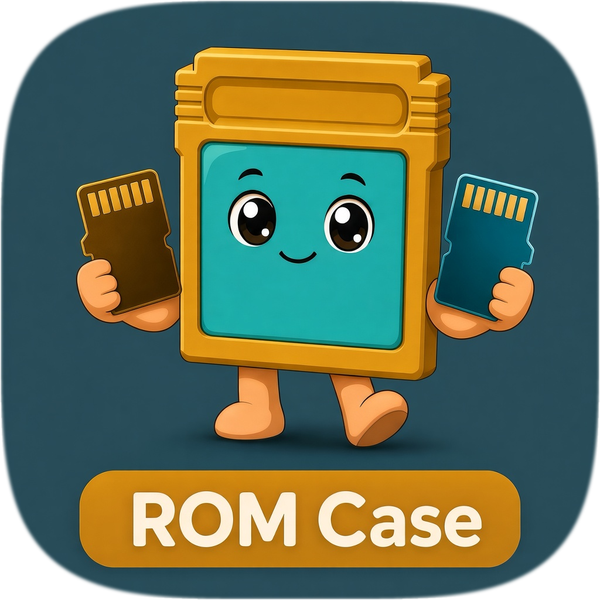

<h1 align="center">ROM Case</h1>

  <a href="README.md">English</a> · <strong>Português</strong>

  App nativa para macOS: estojo de retroconsolas — <strong>R36S</strong>, <strong>Anbernic</strong> (RG35XX e afins), 
  e os cartões com as ROMs, BIOS, saves e capas.

  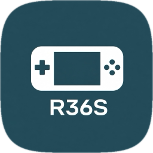
  &nbsp;&nbsp;
  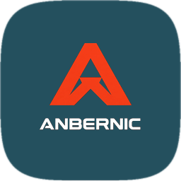
  &nbsp;&nbsp;
  
  &nbsp;&nbsp;
  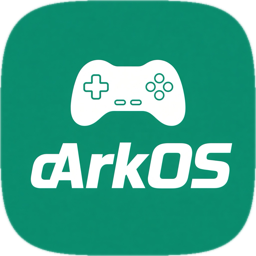
  &nbsp;&nbsp;
  
  &nbsp;&nbsp;
  
  &nbsp;&nbsp;
  
  &nbsp;&nbsp;
  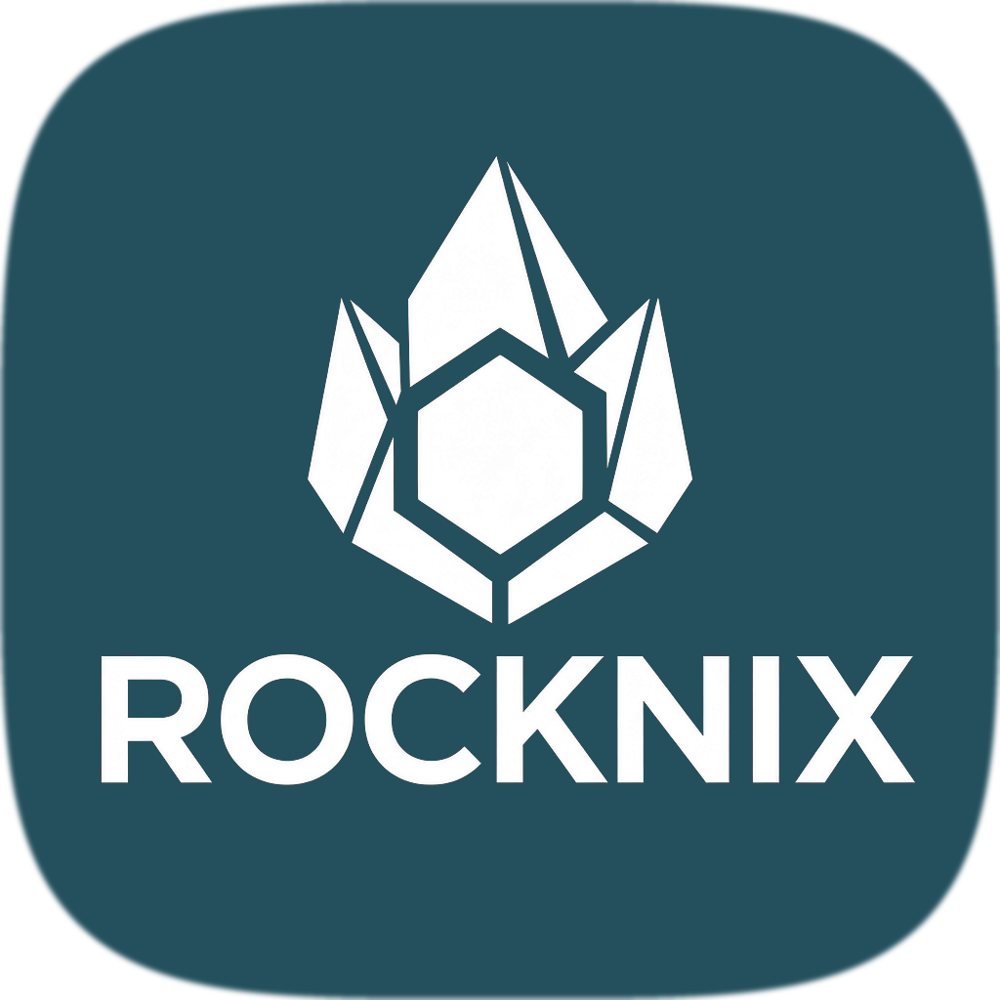
  &nbsp;&nbsp;
  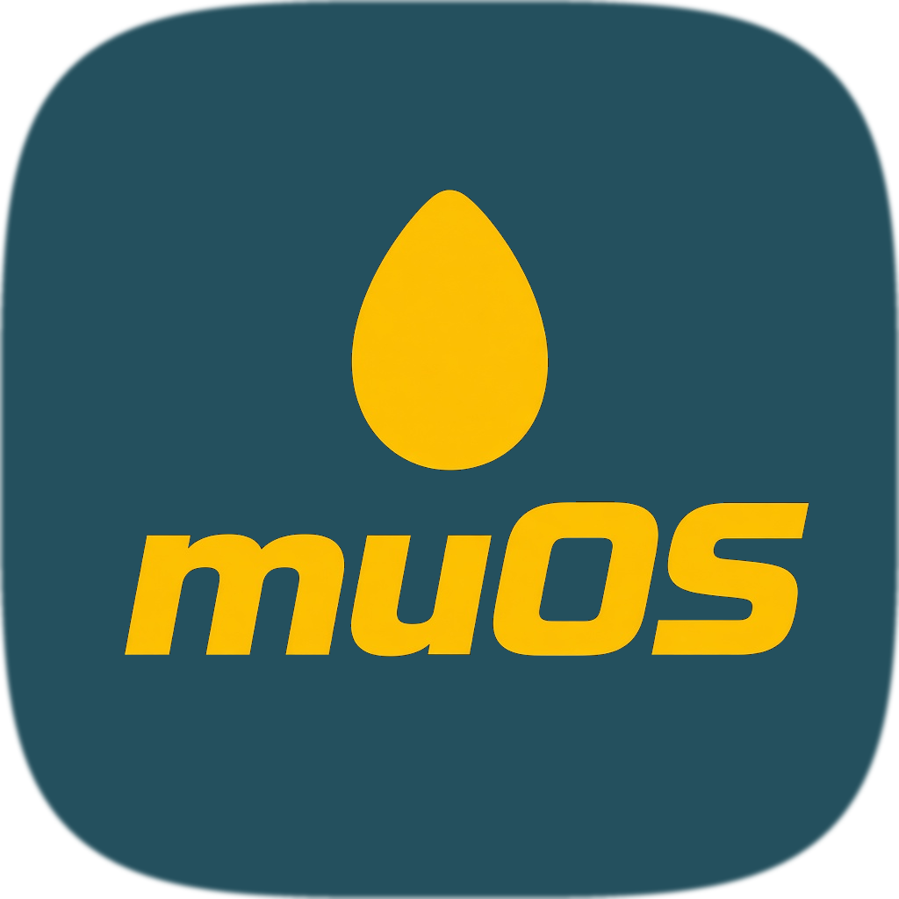

  <strong>ArkOS</strong> · <strong>dArkOS</strong> · <strong>PAN4ELEC</strong> · <strong>AmberELEC</strong> · <strong>KNULLI</strong> ·
  <strong>ROCKNIX</strong> · <strong>Anbernic Stock</strong> · <strong>muOS</strong>

  
  &nbsp;
  
  &nbsp;
  

  <a href="https://github.com/mad4tv/romcase/releases/latest"><strong>Descarregar o instalador (.dmg)</strong></a>
  ·
  v1.5 · macOS 14+ · Apple Silicon
  ·
  <a href="https://www.buymeacoffee.com/joseteixeira">Buy Me a Coffee</a>

  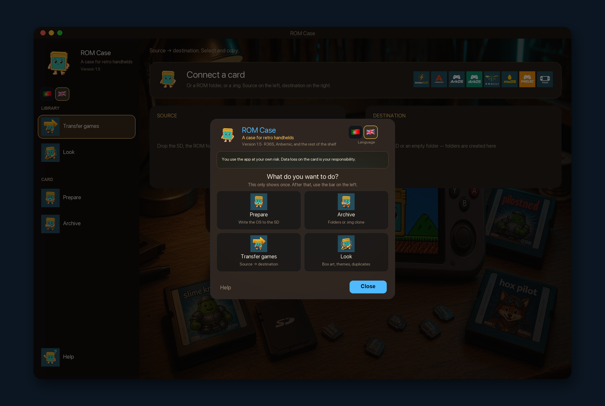

  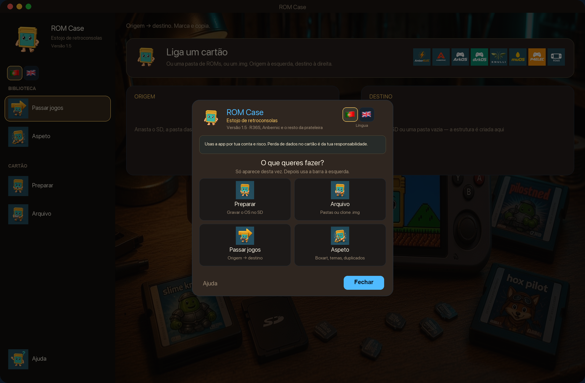
  &nbsp;
  

  Português · English

  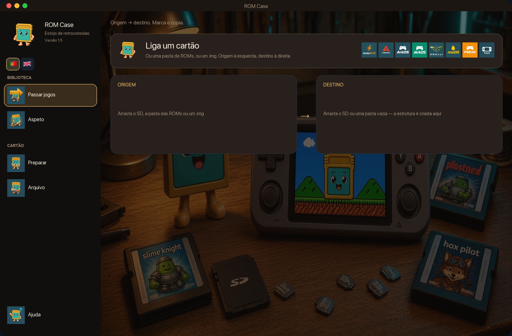
  &nbsp;
  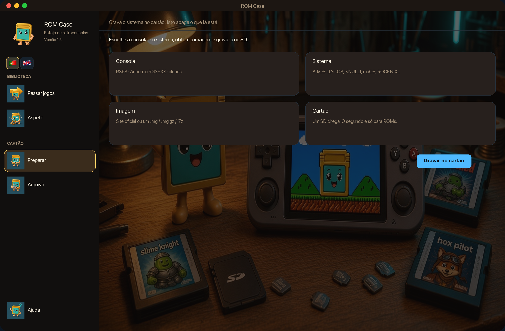

  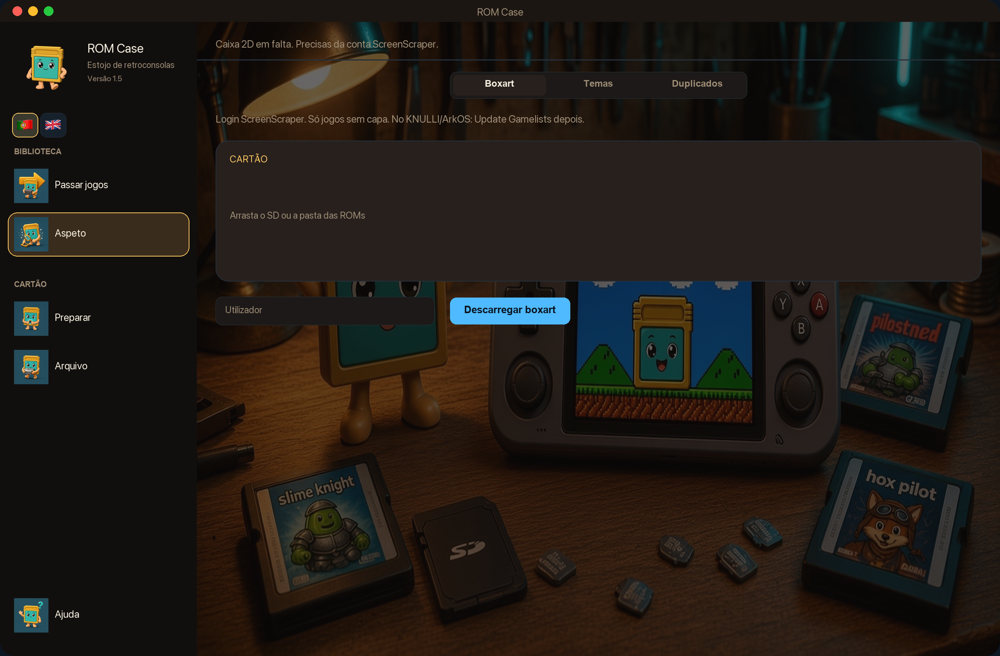
  &nbsp;
  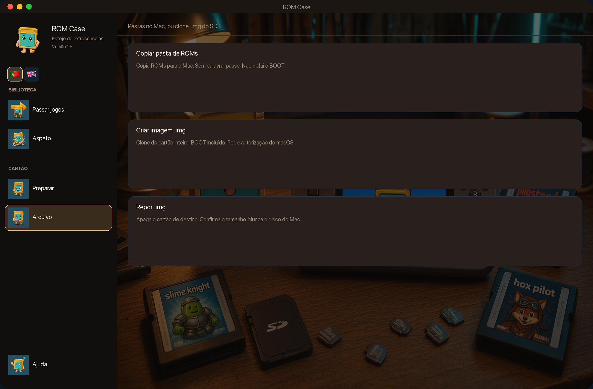

  Passar jogos · Preparar · Boxart · Arquivo

---

## O que é

**ROM Case** é uma app para Mac para quem tem clones **R36S** e consolas **Anbernic** (RG35XX Plus, H, Pro e o resto da prateleira) em mais do que um firmware.

Vê o cartão SD quando o ligas, identifica o OS (ou deixas escolher) e faz o trabalho chato que normalmente é uma janela do Finder, a pasta errada e um `.srm` em falta.

O inglês é a língua predefinida na app quando o macOS não está em português. No menu da primeira abertura (ou na barra à esquerda) clica 🇵🇹 ou 🇬🇧; a escolha fica gravada.

O **código-fonte permanece privado**. Esta página é documentação e descarregas. Clonar este repositório **não** traz o código da app nem um projeto para compilar — só o README e as imagens desta página. O `.dmg` está em [Releases](https://github.com/mad4tv/romcase/releases), não no git. O GitHub não deixa desligar o clone de um repo público.

## Descarregar

**[ROM-Case-1.5.dmg](https://github.com/mad4tv/romcase/releases/latest/download/ROM-Case-1.5.dmg)** — arrasta **ROM Case** para Aplicações.

[Todas as versões](https://github.com/mad4tv/romcase/releases)

### Requisitos

- **macOS 14** (Sonoma) ou superior
- **Apple Silicon** (M1, M2, M3, M4)
- Leitor de cartões SD / USB que o Finder consiga montar
- Opcional: conta [ScreenScraper](https://www.screenscraper.fr) para completar boxart 2D em falta

Não precisas de Xcode para usar a app descarregada.

## O que a app faz

| | Tarefa | |
| :---: | --- | --- |
| 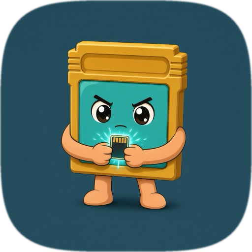 | **Preparar** | Grava o OS num SD vazio (imagem oficial ou um `.img` teu). Consolas típicas: **R36S** (ArkOS, dArkOS, PAN4ELEC, AmberELEC, ROCKNIX, …) e **Anbernic** RG35XX (stock, KNULLI, muOS, ROCKNIX). Segundo cartão opcional só para ROMs. **Apaga o cartão.** |
| 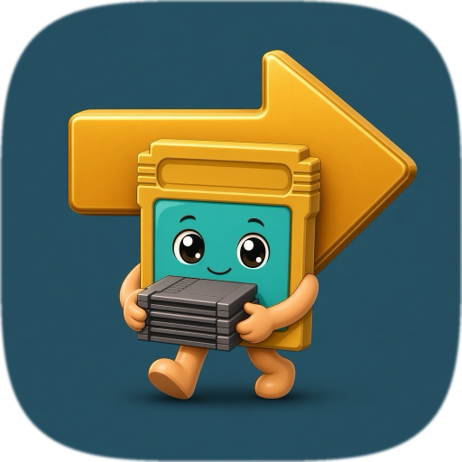 | **Passar jogos** | Origem (SD velho, pasta de ROMs ou `.img` montado) → destino. Copia ROMs, BIOS, saves e capas para a pasta que cada OS usa de verdade. |
| 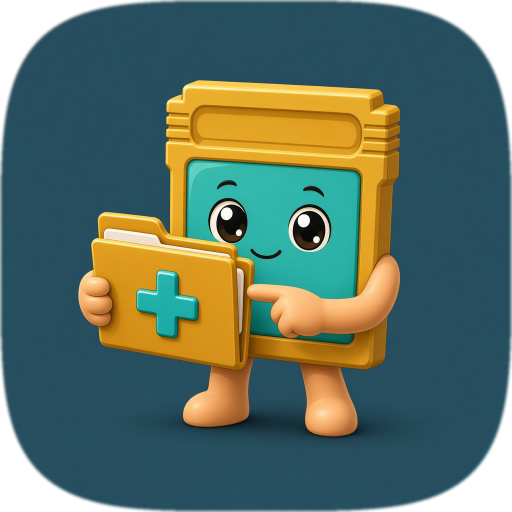 | **Estrutura** | Cria as pastas vazias do OS num cartão novo, antes de copiar. |
| 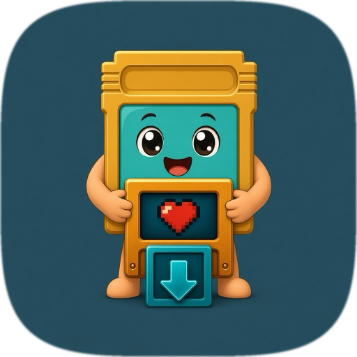 | **Boxart** | Completa a caixa 2D em falta via ScreenScraper (conta de membro no ecrã). Depois Update Gamelists no KNULLI / ArkOS. |
| 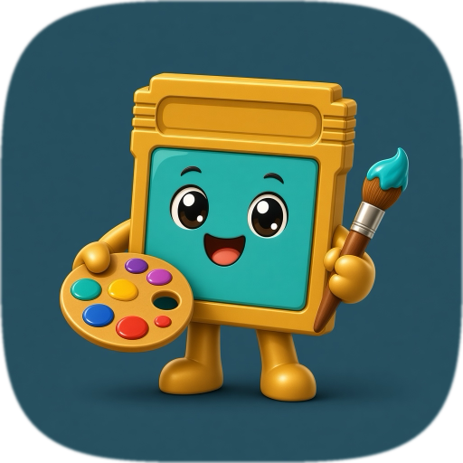 | **Temas** | Listas por OS (ecrãs 4:3 pequenos / Batocera / MustardOS) ou um ZIP / `.muxthm` no cartão. Quem liga o tema é a consola. |
| 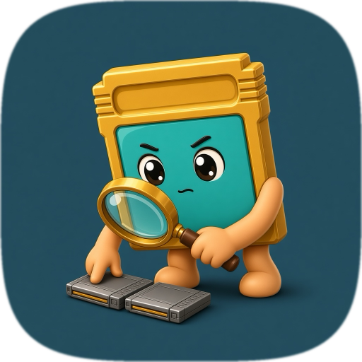 | **Duplicados** | Encontra ROMs iguais no cartão e elimina as cópias extra. Fica sempre uma. |
| 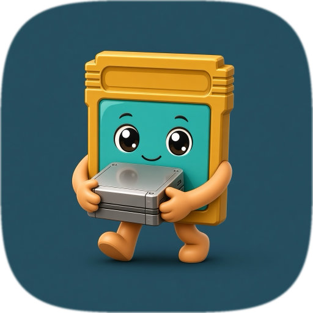 | **Arquivo** | Cópia das pastas de ROMs para o Mac, ou clone **integral** `.img` do SD (BOOT incluído) e reposição depois. |

Também:

- **Ejetar** aparece junto de cada cartão ou disco. Ejeta o SD físico inteiro (BOOT e SHARE), nunca o disco interno do Mac. Um `.img` montado é desmontado.
- **Inglês ou português** no menu da primeira abertura (🇵🇹 / 🇬🇧) e na barra à esquerda. A escolha fica gravada. Passa o rato sobre um botão para ver uma dica nessa língua.
- A primeira abertura mostra um **menu rápido** (Preparar, Arquivo, Passar jogos, Aspeto). Depois usa a barra à esquerda.

Não mistura layouts. Cartões estilo ArkOS (R36S), Batocera/KNULLI, Anbernic stock e muOS ficam cada um nas suas pastas.

## Instalar

1. [Descarrega o `ROM-Case-1.5.dmg`](https://github.com/mad4tv/romcase/releases/latest/download/ROM-Case-1.5.dmg)
2. Se o macOS mostrar **«A Apple não conseguiu confirmar…»** / **Mover para o Lixo**, é o Gatekeeper. **Não** móvas para o Lixo. Clica **OK** e depois:
   - **Definições do Sistema → Privacidade e segurança**
   - Desce até à mensagem sobre o `ROM-Case-1.5.dmg`
   - **Abrir mesmo assim** → confirma **Abrir**
3. Arrasta **ROM Case** para **Aplicações**
4. Se a app em si ficar bloqueada: clique com o botão direito → **Abrir** → confirma
5. Liga um SD, ou larga uma pasta / `.img`

O instalador tem assinatura ad-hoc (ainda sem notarização da Apple). O Safari e o Chrome marcam o download como em quarentena; só uma conta de programador Apple + notarização tira este aviso. Até lá, **Abrir mesmo assim** em Privacidade e segurança é o caminho certo. Não desligues o Gatekeeper.

## Responsabilidade — podes perder dados

**O ROM Case pode apagar ou substituir de forma permanente o que está num cartão SD.** Preparar grava um sistema na consola (o cartão inteiro vai). Repor um `.img` faz o mesmo. **Mover** apaga os ficheiros na origem depois de copiar. **Duplicados** elimina as cópias extra. Um corte de energia, um cartão avariado ou o volume errado pioram o resultado: jogos, saves, BIOS, capas ou o OS da consola podem desaparecer.

**Tu** és responsável por:

- Fazer um backup (**Arquivo**) antes de gravar, mover ou apagar
- Confirmar que o cartão escolhido é o certo (nome e tamanho)
- As ROMs, BIOS e imagens de firmware que escolhes, e por teres o direito de as usar

A app é oferecida **como está, sem garantia**. Na medida permitida pela lei, **José A. Teixeira (AKA Mad4linux)** não responde por perda de dados, cartões danificados, consolas que deixem de arrancar, nem por qualquer outro dano resultante do uso do ROM Case.

Descarregar ou usar a app significa que leste isto e aceitas que o risco e a responsabilidade são teus.

## Sistemas suportados

| OS | Família | Consolas (típico) |
| --- | --- | --- |
| ArkOS 2.0 | ArkOS | **R36S** · AeolusUX (arquivado) |
| dArkOS | ArkOS | **R36S** · dArkOSen |
| AmberELEC | ArkOS | RK3326 · RG351 · também **R36S** |
| PAN4ELEC | ArkOS | **R36S** Panel 4 |
| KNULLI | Batocera | **Anbernic** RG35XX |
| ROCKNIX | Batocera | **R36S** · RG35XX · JELOS |
| Anbernic Stock | Anbernic | **Anbernic** RG35XX Pro / Plus / H · OS original |
| muOS | MustardOS | **Anbernic** RG35XX · ARCHIVE para temas |

## Apoiar o projeto

O **ROM Case** é feito por **José A. Teixeira** (AKA Mad4linux).

Se te poupou uma noite a copiar a pasta errada:

**[Buy Me a Coffee](https://www.buymeacoffee.com/joseteixeira)**

## Créditos

**ROM Case** — © 2026 José A. Teixeira · AKA Mad4linux
