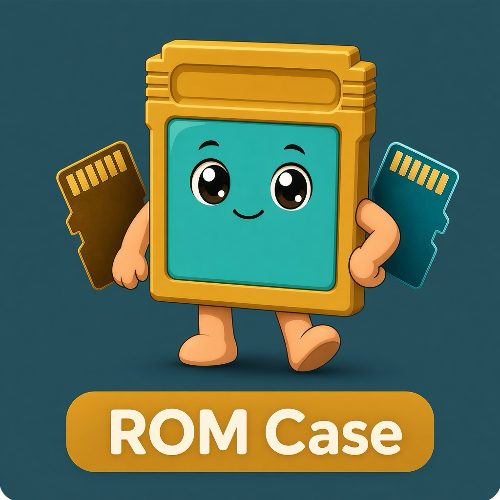
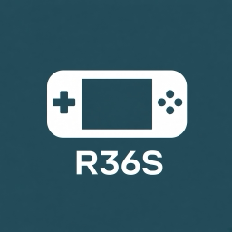
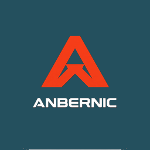
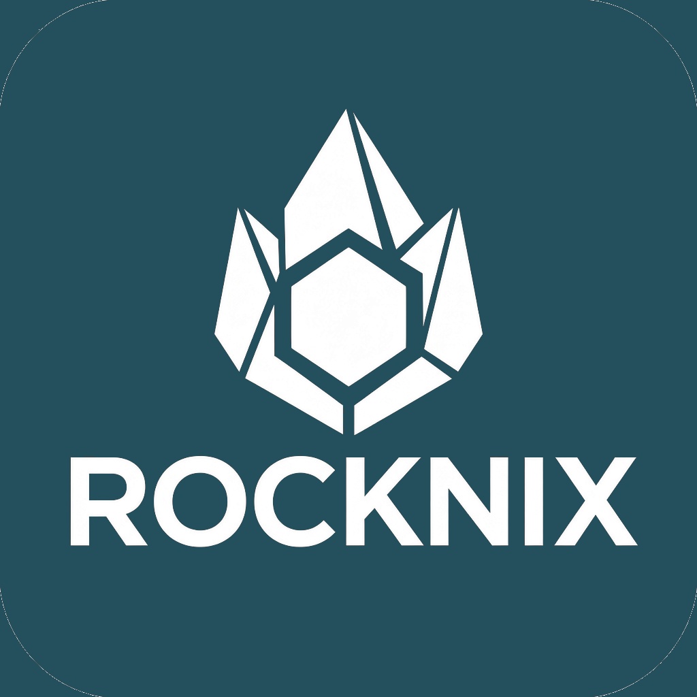
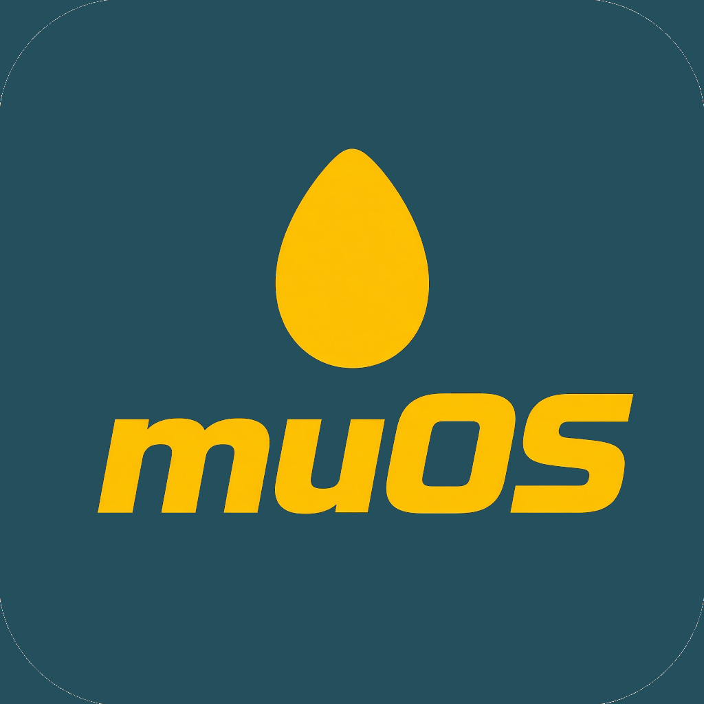
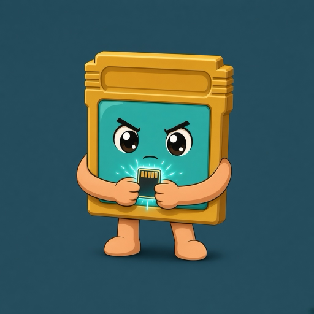
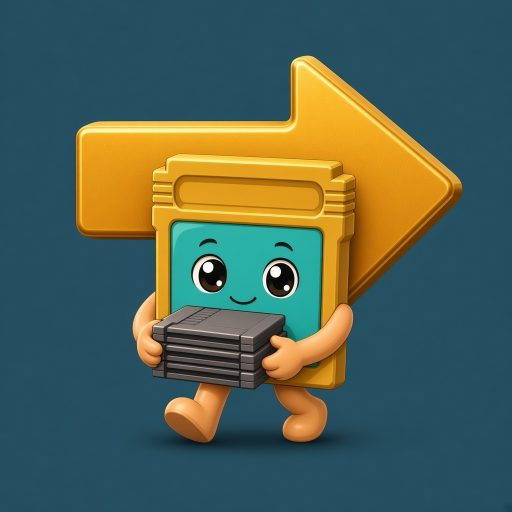
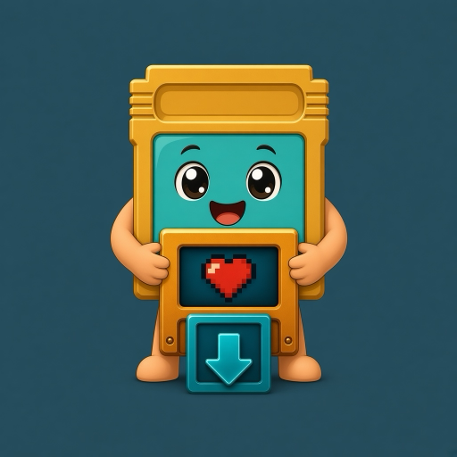
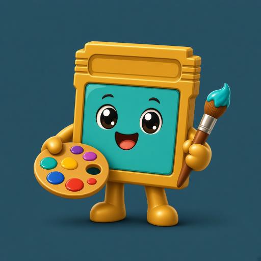
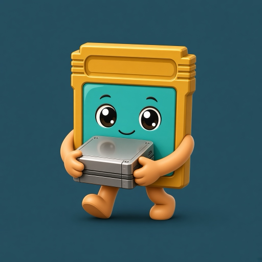

  

<h1 align="center">ROM Case</h1>

  <a href="README.md">English</a> · <strong>Português</strong>

  App nativa para macOS: estojo de retroconsolas — <strong>R36S</strong>, <strong>Anbernic</strong> (RG35XX e afins), 
  e os cartões com as ROMs, BIOS, saves e capas.

  
  &nbsp;&nbsp;
  
  &nbsp;&nbsp;
  
  &nbsp;&nbsp;
  
  &nbsp;&nbsp;
  
  &nbsp;&nbsp;
  
  &nbsp;&nbsp;
  
  &nbsp;&nbsp;
  
  &nbsp;&nbsp;
  

  <strong>ArkOS</strong> · <strong>dArkOS</strong> · <strong>PAN4ELEC</strong> · <strong>AmberELEC</strong> · <strong>KNULLI</strong> ·
  <strong>ROCKNIX</strong> · <strong>Anbernic Stock</strong> · <strong>muOS</strong>

  
  &nbsp;
  

  <a href="https://github.com/mad4tv/romcase/releases/latest"><strong>Descarregar o instalador (.dmg)</strong></a>
  ·
  v1.2.1 · macOS 14+ · Apple Silicon
  ·
  <a href="https://www.buymeacoffee.com/joseteixeira">Buy Me a Coffee</a>

---

## O que é

**ROM Case** é uma app para Mac para quem tem clones **R36S** e consolas **Anbernic** (RG35XX Plus, H, Pro e o resto da prateleira) em mais do que um firmware.

Vê o cartão SD quando o ligas, identifica o OS (ou deixas escolher) e faz o trabalho chato que normalmente é uma janela do Finder, a pasta errada e um `.srm` em falta.

O inglês é a língua predefinida na app quando o macOS não está em português. No menu da primeira abertura (ou na barra à esquerda) clica 🇵🇹 ou 🇬🇧; a escolha fica gravada.

O **código-fonte permanece privado**. Esta página é a documentação pública e o sítio de onde se descarrega a app.

## Descarregar

**[ROM-Case-1.2.1.dmg](https://github.com/mad4tv/romcase/releases/latest/download/ROM-Case-1.2.1.dmg)** — arrasta **ROM Case** para Aplicações.

[Todas as versões](https://github.com/mad4tv/romcase/releases)

### Requisitos

- **macOS 14** (Sonoma) ou superior
- **Apple Silicon** (M1, M2, M3, M4)
- Leitor de cartões SD / USB que o Finder consiga montar
- Primeira abertura: **clique com o botão direito → Abrir** (a app tem assinatura ad-hoc; o Gatekeeper pergunta uma vez)
- Opcional: conta [ScreenScraper](https://www.screenscraper.fr) para completar boxart 2D em falta

Não precisas de Xcode para usar a app descarregada.

## O que a app faz

| | Tarefa | |
| :---: | --- | --- |
|  | **Preparar** | Grava o OS num SD vazio (imagem oficial ou um `.img` teu). Consolas típicas: **R36S** (ArkOS, dArkOS, PAN4ELEC, AmberELEC, ROCKNIX, …) e **Anbernic** RG35XX (stock, KNULLI, muOS, ROCKNIX). Segundo cartão opcional só para ROMs. **Apaga o cartão.** |
|  | **Passar jogos** | Origem (SD velho, pasta de ROMs ou `.img` montado) → destino. Copia ROMs, BIOS, saves e capas para a pasta que cada OS usa de verdade. |
|  | **Estrutura** | Cria as pastas vazias do OS num cartão novo, antes de copiar. |
|  | **Boxart** | Completa a caixa 2D em falta via ScreenScraper (conta de membro no ecrã). Depois Update Gamelists no KNULLI / ArkOS. |
|  | **Temas** | Listas por OS (ecrãs 4:3 pequenos / Batocera / MustardOS) ou um ZIP / `.muxthm` no cartão. Quem liga o tema é a consola. |
|  | **Duplicados** | Encontra ROMs iguais no cartão e elimina as cópias extra. Fica sempre uma. |
|  | **Arquivo** | Cópia das pastas de ROMs para o Mac, ou clone **integral** `.img` do SD (BOOT incluído) e reposição depois. |

Também: a app **ejeta** o cartão físico inteiro (não uma partição) em todos os sítios onde há cartão ou disco, e **recusa** listar ou tocar no disco interno do Mac.

Não mistura layouts. Cartões estilo ArkOS (R36S), Batocera/KNULLI, Anbernic stock e muOS ficam cada um nas suas pastas.

## Instalar

1. [Descarrega o `ROM-Case-1.2.1.dmg`](https://github.com/mad4tv/romcase/releases/latest/download/ROM-Case-1.2.1.dmg)
2. Abre o disco e arrasta **ROM Case** para **Aplicações**
3. Na primeira vez: clique com o botão direito na app → **Abrir** → confirma
4. Liga um SD, ou larga uma pasta / `.img`

Se o macOS disser que a app é de um programador não identificado, é a assinatura ad-hoc. O caminho certo é clique direito → Abrir; não desligues o Gatekeeper.

## Sistemas suportados

| OS | Família | Consolas (típico) |
| --- | --- | --- |
| ArkOS 2.0 | ArkOS | **R36S** · AeolusUX (arquivado) |
| dArkOS | ArkOS | **R36S** · dArkOSen |
| AmberELEC | ArkOS | RK3326 · RG351 · também **R36S** |
| PAN4ELEC | ArkOS | **R36S** Panel 4 |
| KNULLI | Batocera | **Anbernic** RG35XX |
| ROCKNIX | Batocera | **R36S** · RG35XX · JELOS |
| Anbernic Stock | Anbernic | **Anbernic** RG35XX Pro / Plus / H · OS original |
| muOS | MustardOS | **Anbernic** RG35XX · ARCHIVE para temas |

## Apoiar o projeto

O **ROM Case** é feito por **José A. Teixeira** (AKA Mad4linux).

Se te poupou uma noite a copiar a pasta errada:

**[Buy Me a Coffee](https://www.buymeacoffee.com/joseteixeira)**

## Créditos

**ROM Case** — © 2026 José A. Teixeira · AKA Mad4linux
